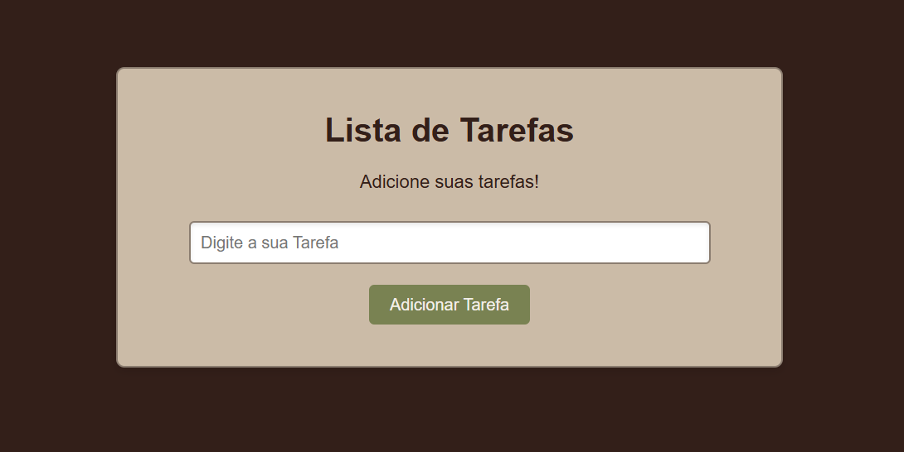

# 📋 Lista de Tarefas

Este é o meu primeiro projeto prático de programação, desenvolvido majoritariamente em **JavaScript**.A ideia surgiu acompanhando um modelo no [canal da Rafaella Ballerini](https://www.youtube.com/@rafaellaballerini), mas com modificações e melhorias próprias. 🚀

---

## 🎯 Funcionalidades

- ➕ Adicionar tarefas
- ✏️ Editar tarefas existentes
- ❌ Remover tarefas da lista
- 📝 Mensagens de feedback (sucesso/erro)
- 🎨 Interface simples e estilizada com CSS

---

## 🖼️ Demonstração



---

## 🛠️ Tecnologias utilizadas

- **HTML5** → Estrutura da página
- **CSS3** → Estilização e design responsivo
- **JavaScript** → Lógica de adicionar, editar e remover tarefas

---

## 🚀 Como executar o projeto

1. Clone o repositório:
   ```bash
   git clone https://github.com/joaopedrocabral/lista-de-tarefas.git
   ```

2. Acesse a pasta do projeto:
   ```bash
   cd lista-de-tarefas
   ```

3. Abra o arquivo `index.html` no navegador.

---

## 👤 Autor

**João Pedro Cabral**  
🔗 [Meu GitHub](https://github.com/joaopedrocabral)

---

✨ Esse projeto é parte do meu aprendizado inicial em programação. Qualquer dica ou sugestão é bem-vinda!
